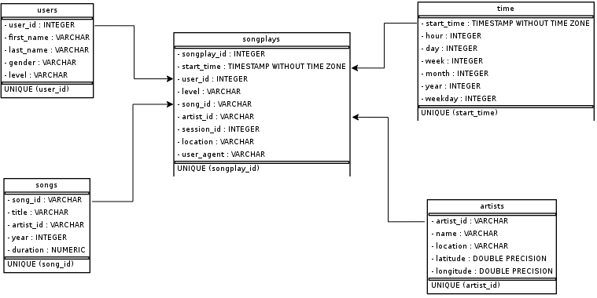

# UDACITY DATA ENGINEERING NANODEGREE 
## PROJECT 1: DATA MODELING WITH POSTGRES

This project based on imaginary startup called Sparkify. Their analytical teams want to analyze song and user data from their newly created streaming app. Currently these data are saved as a log fil in JSON file format, which is hard to analyze. 

Therefore data engineer create a Postgres database with tables designed to optimize queries on song play analysis. As a data engineer, we create a database schema and etl pipeline to process the log data and insert it into database. 

---

Data engineer using star schema to define the database. This database consist of:

**Fact Table**

1. **songplays** - records in log data associated with song plays i.e. records with page NextSong
    * songplay_id, start_time, user_id, level, song_id, artist_id, session_id, location, user_agent

**Dimension Tables**
1. **users** - users in the app
    * user_id, first_name, last_name, gender, level
2. **songs** - songs in music database
    * song_id, title, artist_id, year, duration
3. **artists** - artists in music database
    * artist_id, name, location, latitude, longitude
4. **time** - timestamps of records in songplays broken down into specific units
    * start_time, hour, day, week, month, year, weekday



---

This repository contains of file needed to achieve this objective.
1. data/log_data: log files event from the app
2. data/song_data: song metadata files
3. [etl.ipynb](./etl.ipynb): notebook for development of etl process
4. [etl.py](./etl.py): etl script to read all files from data and insert record into database
5. [create_table.py](./create_table.py): script for creating table and drop (if needed)
6. [sql_queries.py](./sql_queries.py): script to run all SQL needed in etl
7. [test.ipynb](./test.ipynb): notebook to test if the etl pipeline run as expected or not

Here are steps needed to run this etl
1. run `create_tables.py` to set up the database
2. run `etl.py` to run the etl process

```shell
python create_tables.py
python etl.py
```
